# Architecture

Every component of Work Shadower and how they connect. All diagrams are Mermaid, so GitHub renders them in place.

1. [System overview](#1-system-overview)
2. [Deployment](#2-deployment)
3. [Mac app (Dot) components](#3-mac-app-dot-components)
4. [Dot states](#4-dot-states)
5. [Server components](#5-server-components)
6. [Web app components](#6-web-app-components)
7. [Data model](#7-data-model)
8. [Flow: record → draft skill](#8-flow-record--draft-skill)
9. [Flow: review, publish, search](#9-flow-review-publish-search)
10. [Flow: "Do it for me" replay](#10-flow-do-it-for-me-replay)
11. [Job queue lifecycle](#11-job-queue-lifecycle)
12. [Privacy and trust boundaries](#12-privacy-and-trust-boundaries)

---

## 1. System overview

Three apps, one API contract (`docs/CONTRACT.md`).

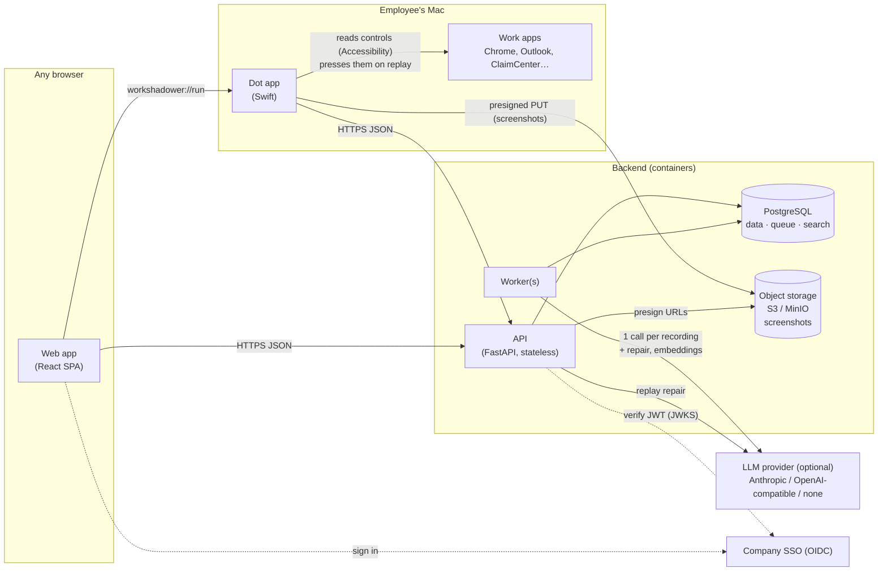

## 2. Deployment

The same image runs the API (and serves the web app) and the worker. Both scale out by adding containers.

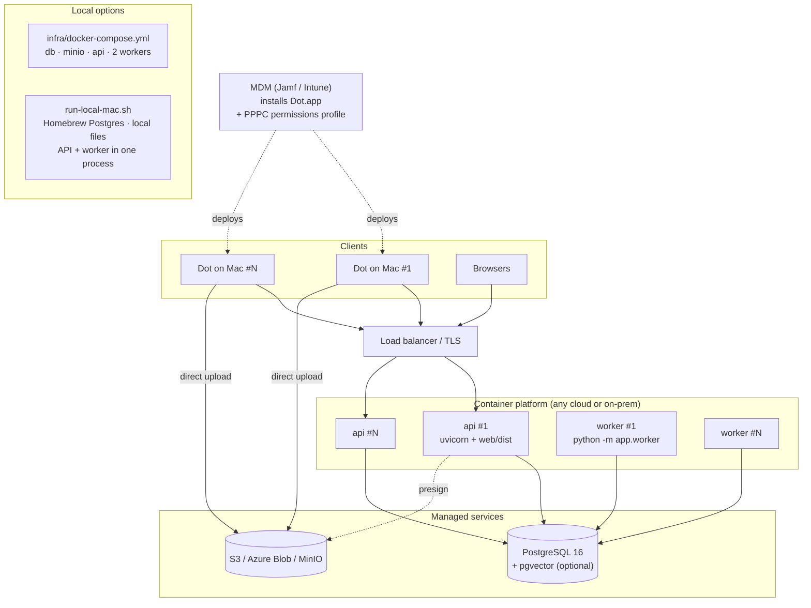

## 3. Mac app (Dot) components

`DotCore` is plain Swift and unit tested on any platform. `DotApp` is the AppKit/SwiftUI shell.

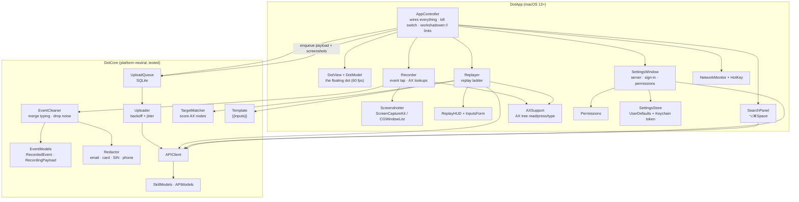

## 4. Dot states

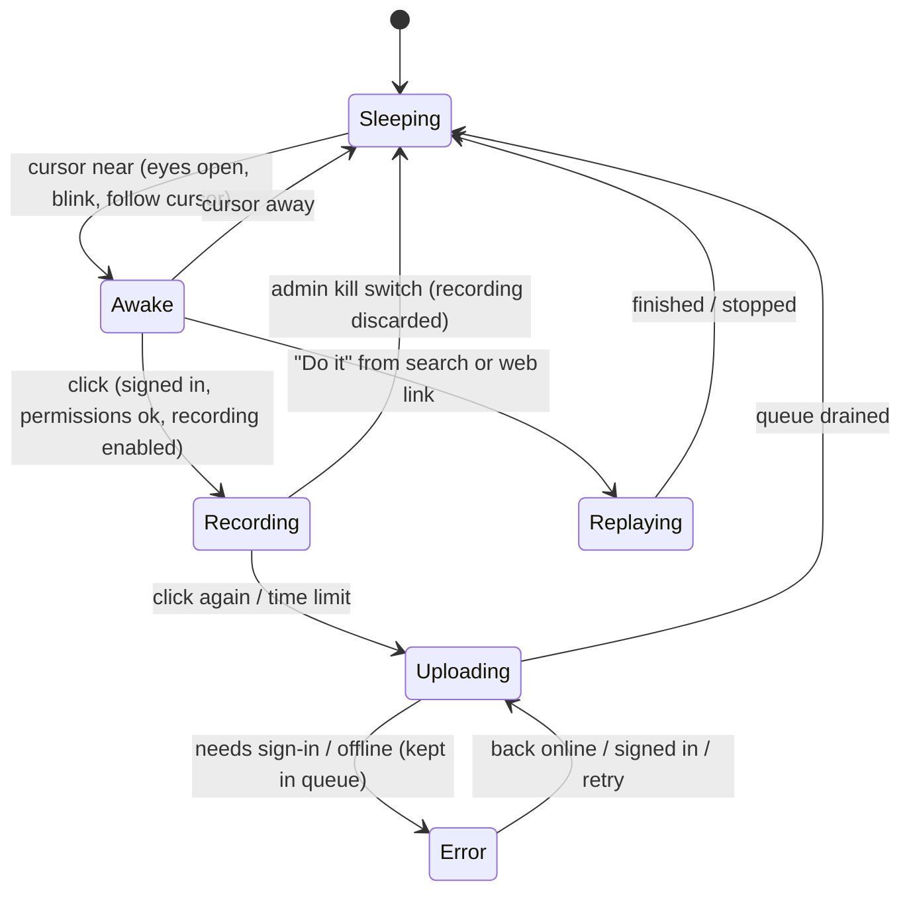

| State | Look |
|---|---|
| Sleeping | Eyes closed, slow breathing |
| Awake | Eyes open, blinking, pupils follow cursor |
| Recording | Red pulsing ring, timer on hover |
| Uploading | Progress arc |
| Replaying | Green ring + step HUD |
| Error | Amber ring, reason in tooltip |

## 5. Server components

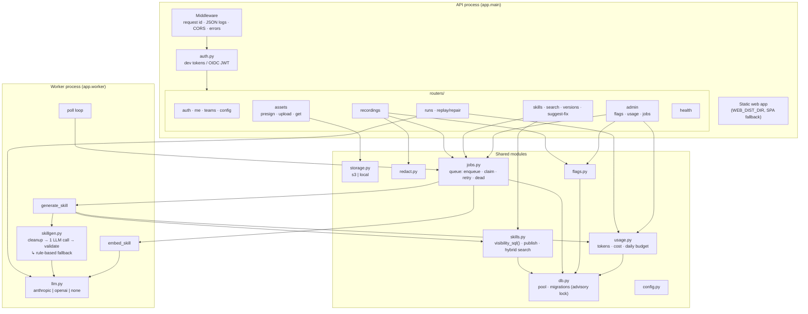

## 6. Web app components

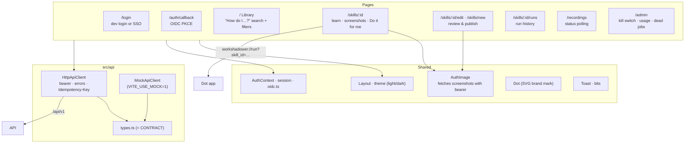

## 7. Data model

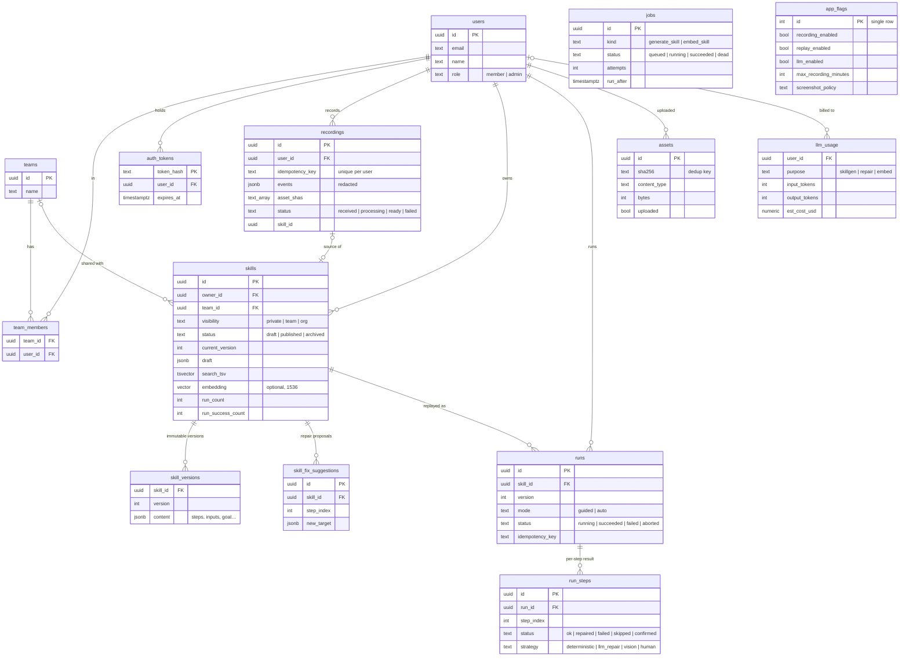

## 8. Flow: record → draft skill

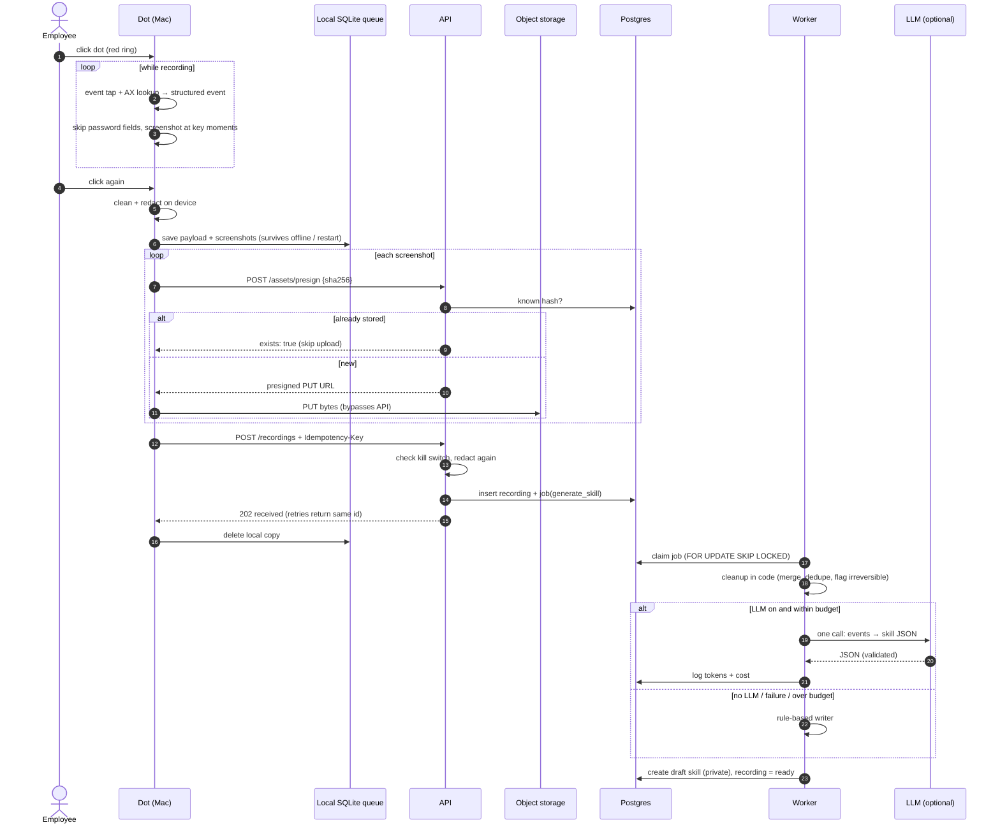

## 9. Flow: review, publish, search

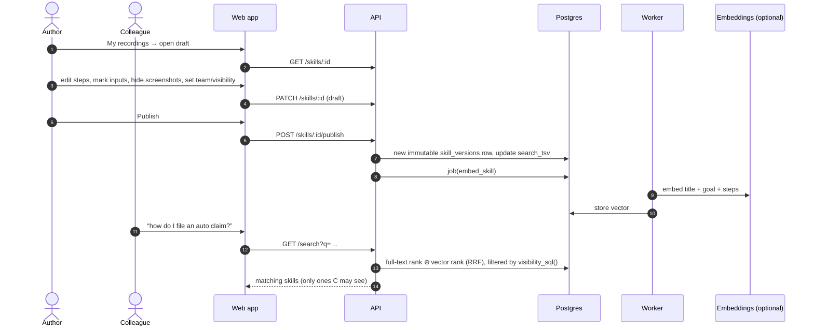

## 10. Flow: "Do it for me" replay

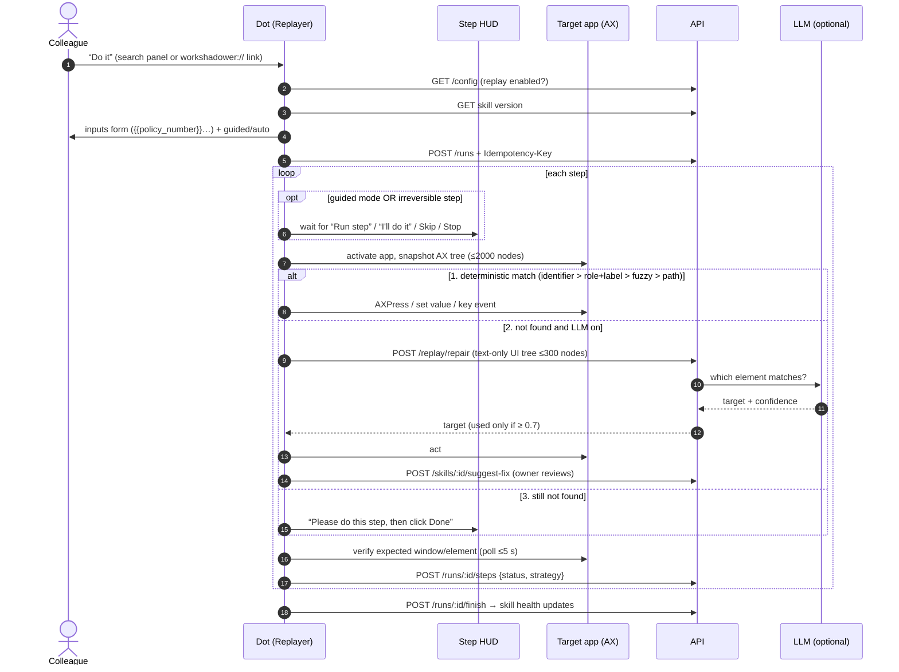

## 11. Job queue lifecycle

Postgres is the queue. Many workers can run safely because each claim uses `FOR UPDATE SKIP LOCKED`.

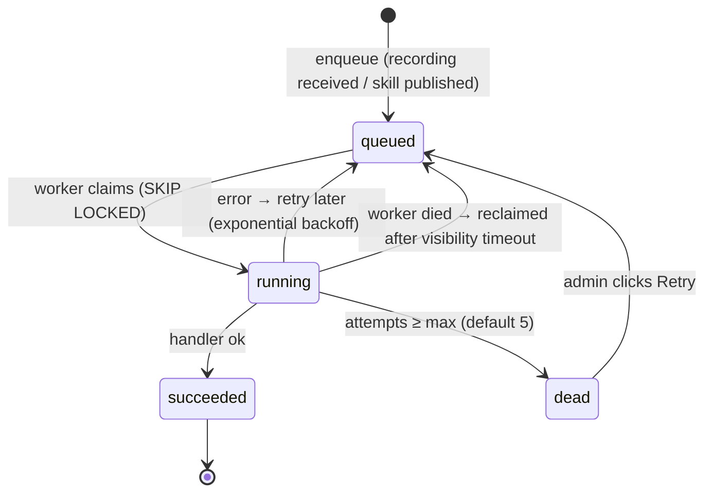

## 12. Privacy and trust boundaries

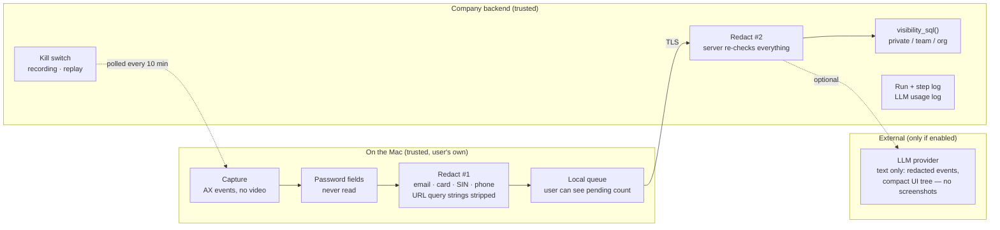

Rules that hold everywhere:

- Nothing is recorded unless the red ring is showing.
- Drafts are private until the author publishes.
- Replay never performs an irreversible step without a human click.
- Screenshots never go to the LLM.
- Logs contain counts and states, never typed text, labels or URLs.
